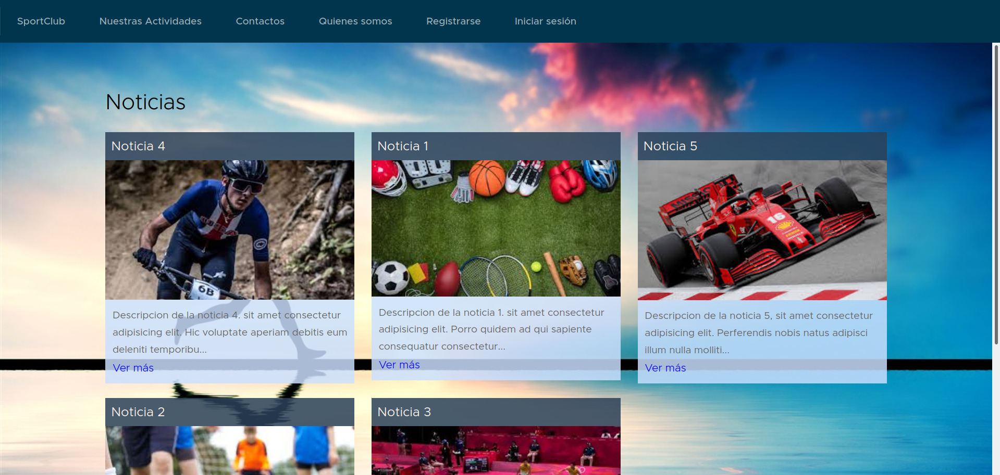
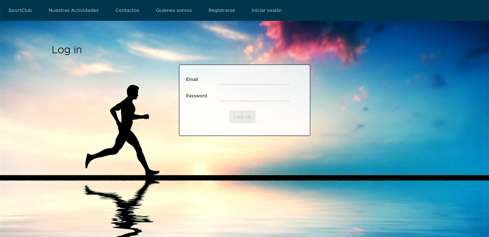
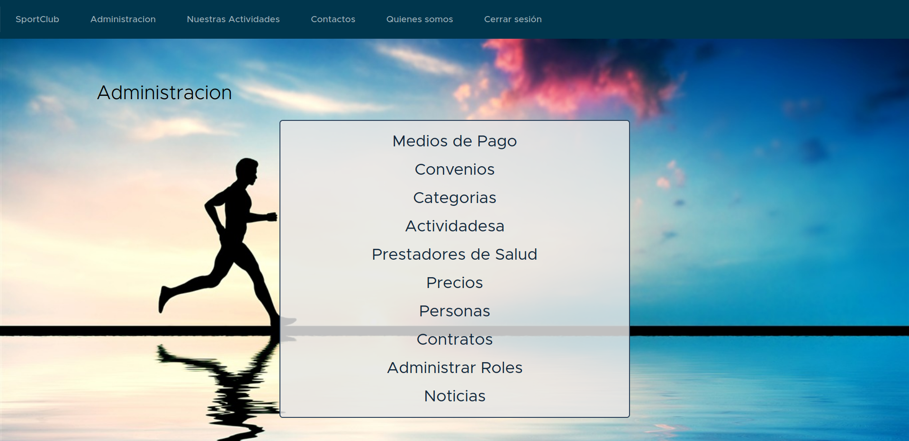
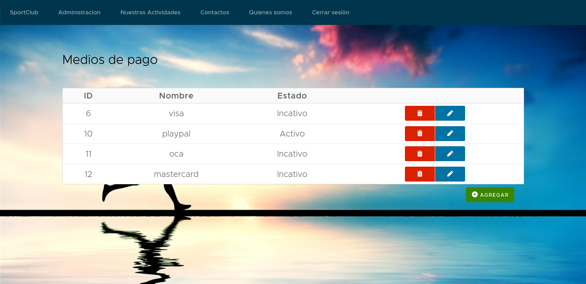
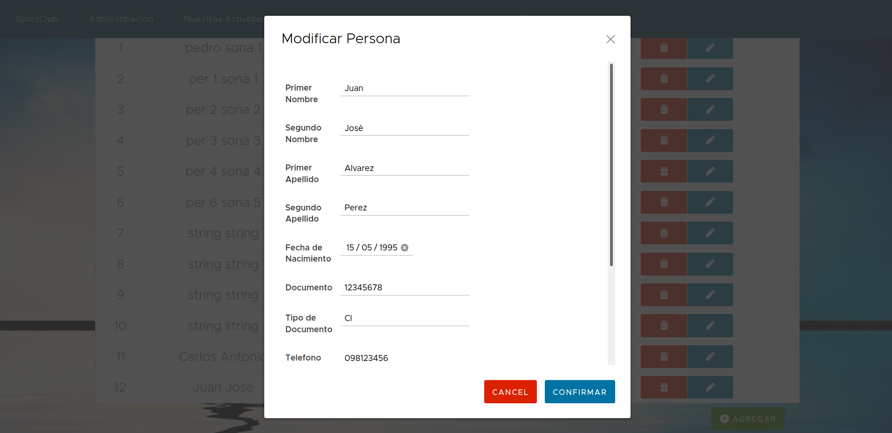

# SportClub

## Información
El laboratorio final se plantea en el marco de la edición 2020 de la asignatura **Taller de Aplicaciones de Internet Ricas**. El mismo consiste en el diseño y construccion de una aplicacion SPA (Single Page Application) utilizando un framework CSS específico.  
El objetivo es aplicar los conceptos brindados en clase más los conocimientos adquiridos durante la investigacion de los frameworks.
Dicha aplicación debe desarrollarse utilizando el framework Angular y Clarity CSS. 

## Capturas

### Página de noticias

### Login

### Menú de funcionarios

### Listado

### Formulario de modificación

